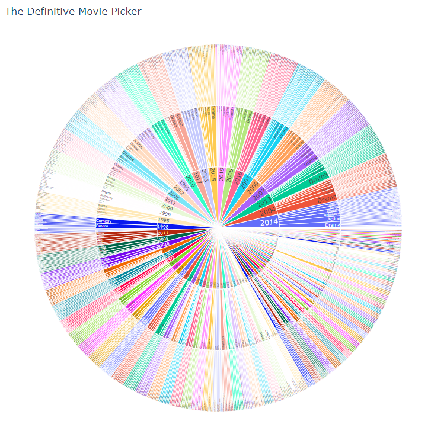

# top_1000_movies-data_science_project

Created from a very large json file with lots of information about IMDB's 1000 top rated movies of all time, which also contains the metarcritic ratings.

Contains graphs about some of the best movies to watch, actors which appear frequently in these above-average films, or the final battle of the directors between Hitchcock vs Spielberg.

Check this project to see my very handy movie recomendator (see image). You pick a year by clicking on one of the options from inner circle: each colour is a year. The year will expand showing the options from the middle circle, the possible genres. Pick one and it will expand again showing you the contents from the outer circle, some great movies in that year for that genre, all of them inside the top 1000 IMDB movies of all time.

